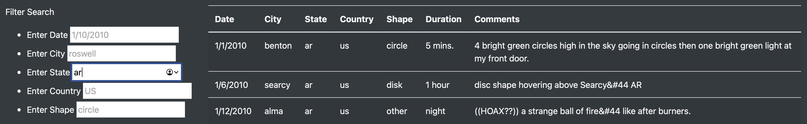

# UFOs
## Overview
The purpose of this analysis is to produce a website containing data about UFO (unidentified flying object, i.e., presumably alien spaceship) sightings, where the user can search the data by 5 distinct parameters:
- date,
- city,
- state,
- country &
- shape (i.e., the shape of the UFO in question).

## Results
The filter search functions allow the user to search by an individual parameter or by any number of the parameters simultaneously.

For example, one could search for all UFO sitings in a given state:

Or, one could filter by all 5 parameters at once:

## Summary
The website has several drawbacks:
1. searches are case-sensitive, such that searching "AR" for the "state" parameter does not return results for Arkansas, whereas searching "ar" does &
2. searches by date are limited to searching an exact date, rather than allowing for disaggregation of the date into years, months, and days of the month.
